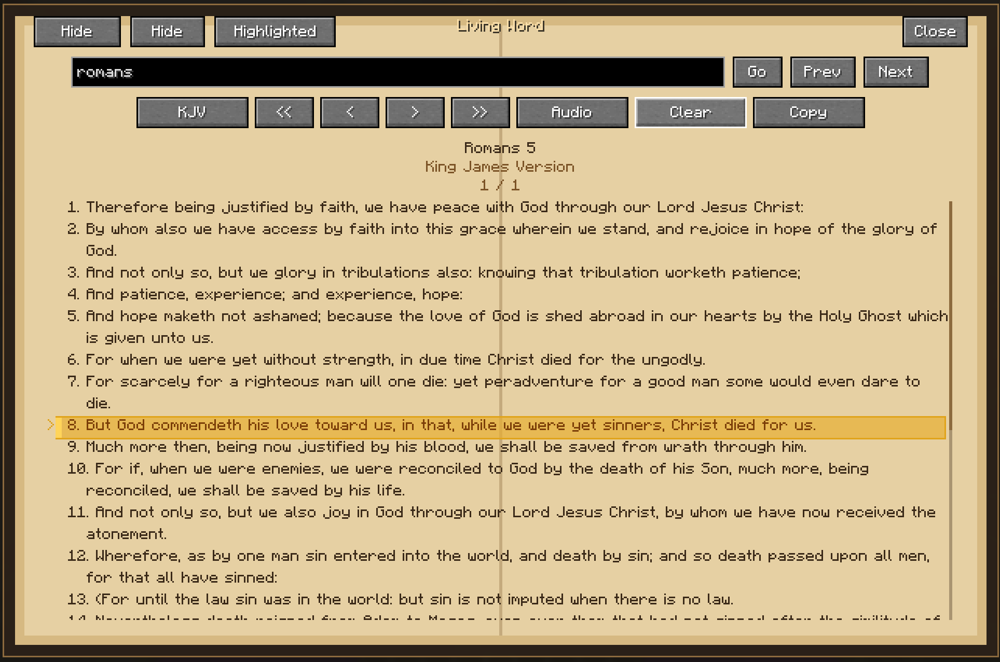
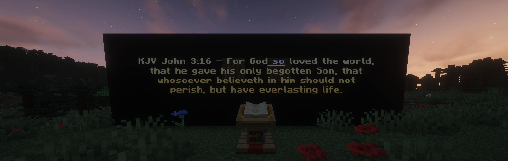
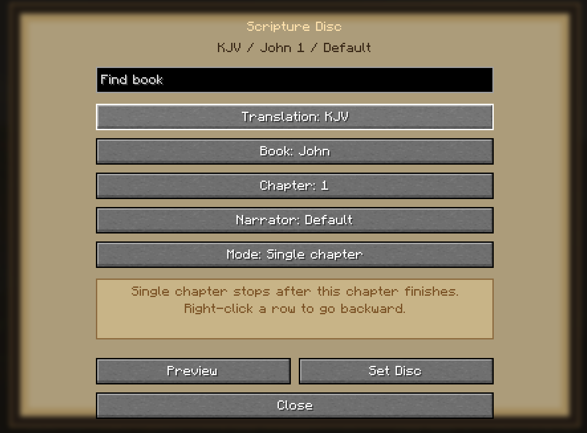

# Living Word

MODRINTH LINK: https://modrinth.com/mod/living-word

Living Word is a NeoForge 1.21.1 Minecraft mod for peaceful in-game Bible reading, synchronized scripture listening, lectern study stations, Scripture Disc playback, and simple devotional tools.

The mod is designed to feel calm, respectful, and vanilla-adjacent. It is not a combat, spellcasting, or magic system.

## Features

- In-game Bible item with searchable scripture reading
- Bundled data-driven Bible translations: BSB, KJV, and WEBP
- Highlighted verses shared across translations by verse reference
- Scripture Disc item for selecting passages and playing narration through jukeboxes
- Lectern listening stations with synchronized playback and floating verse display
- On-demand audio streaming and local client caching
- Verse and word timing sidecars for supported narrators
- Multiplayer session synchronization without relaying audio through the server
- Shofar item with long-range sound
- Advancements and vanilla-style recipes

## Install

Requirements:

- Minecraft Java Edition 1.21.1
- NeoForge 21.1.x
- Java 21

Install the built jar into the client `mods` folder. Dedicated servers also need the same jar in the server `mods` folder.

The current development artifact is:

```text
build/libs/living-word-0.1.0.jar
```

## Quick Test Commands

```mcfunction
/give @p livingword:bible
/give @p livingword:scripture_disc
/give @p livingword:shofar
```

## Audio

Large Bible audio files are not bundled in the jar. Clients stream chapter audio from configured public providers and cache it locally for later offline playback.

The server only synchronizes passage, playback state, timestamps, session membership, and position corrections. Each client downloads or streams audio independently.

See [docs/audio-packs.md](docs/audio-packs.md) for provider and pack details.

## Screenshots

Release screenshots are collected in [docs/screenshots](docs/screenshots).







## Content And Licensing

Source code is MIT licensed. Bible texts, streamed audio, generated timing data, item art, and bundled sounds have their own source notices.

Read [NOTICE.md](NOTICE.md) before redistributing the mod or uploading it to a mod platform.

## Development

- Minecraft: 1.21.1
- NeoForge: 21.1.200
- Java: 21
- Mod ID: `livingword`
- Root package: `com.livingword`

Run Gradle through the checked-in wrapper:

```powershell
.\gradlew.bat --version
.\gradlew.bat test
.\gradlew.bat build
.\gradlew.bat runClient
```

Useful docs:

- [Translation packs](docs/translation-packs.md)
- [Audio packs](docs/audio-packs.md)
- [Testing](docs/testing.md)
- [Release checklist](docs/release-checklist.md)
